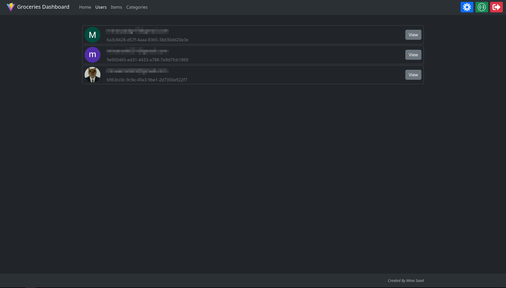
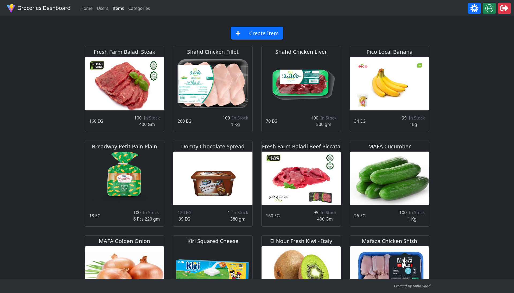
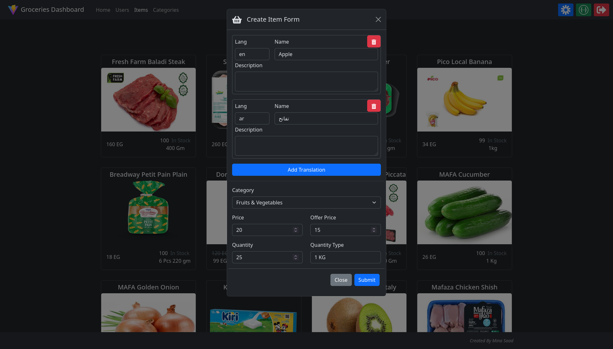
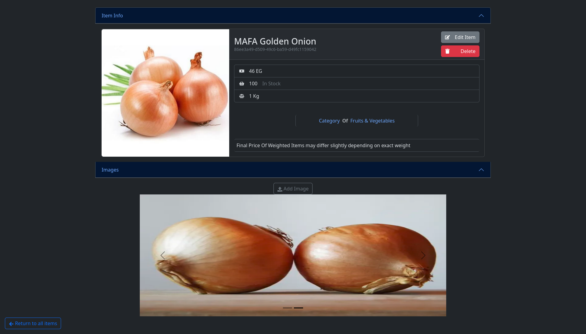
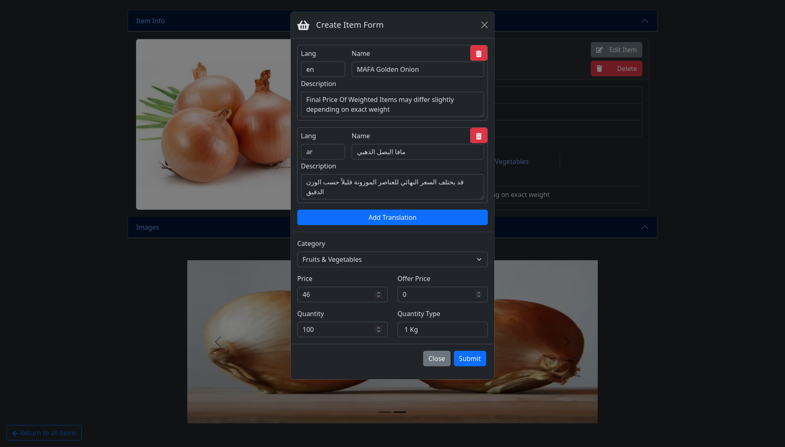
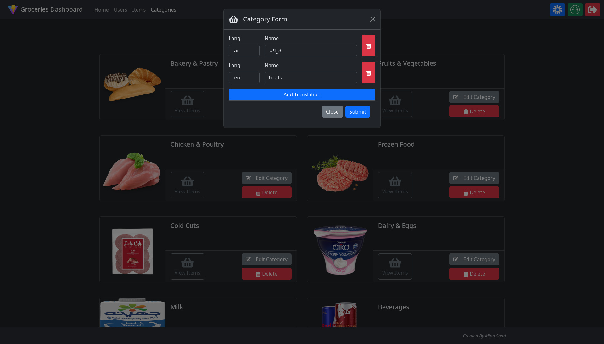

<h1 align="center"> 
backend and admin panel for <a href="https://github.com/Mina329/nectar">Nectar</a>
</h1>

  

## Features ✨

- [📋 Admin Panel](https://groceries-monorepo.onrender.com/)
- [📘 API Docs](https://groceries-monorepo.onrender.com/api/v1/docs)
- [📱 Mobile Application](https://github.com/Mina329/nectar)

  

<h2 align="center">Admin Panel</h2>

<table style="width: 100%">
    <tbody style="width: 100%">
        <tr style="width: 100%">
            <td style="width: 30%">
                
            </td>
            <td style="width: 30%">
                
            </td>
            <td style="width: 30%">
                
            </td>
        </tr>
        <tr style="width: 100%">
            <td style="width: 30%">
                
            </td>
            <td style="width: 30%">
                
            </td>
            <td style="width: 30%">
                
            </td>
        </tr>
    </tbody>
</table>
